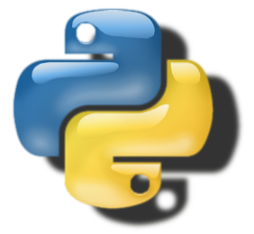
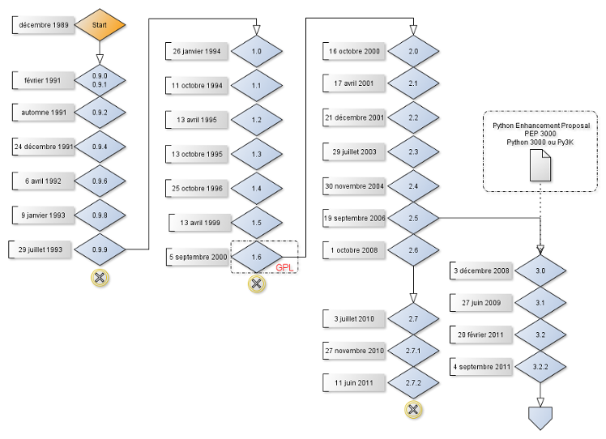
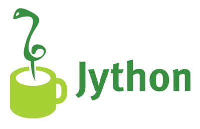
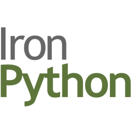
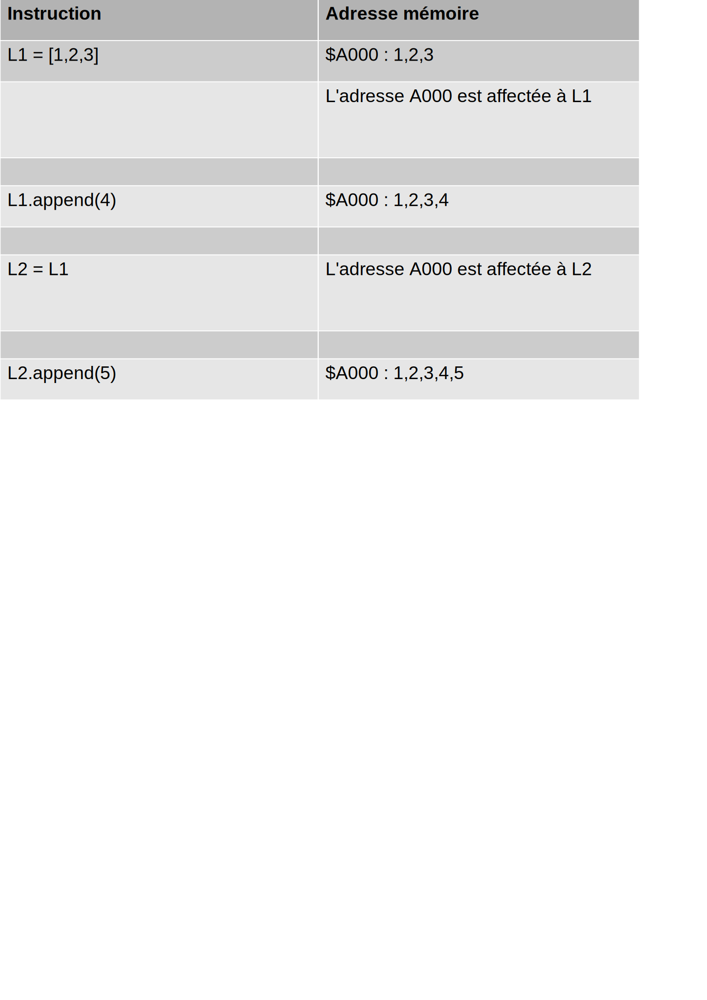
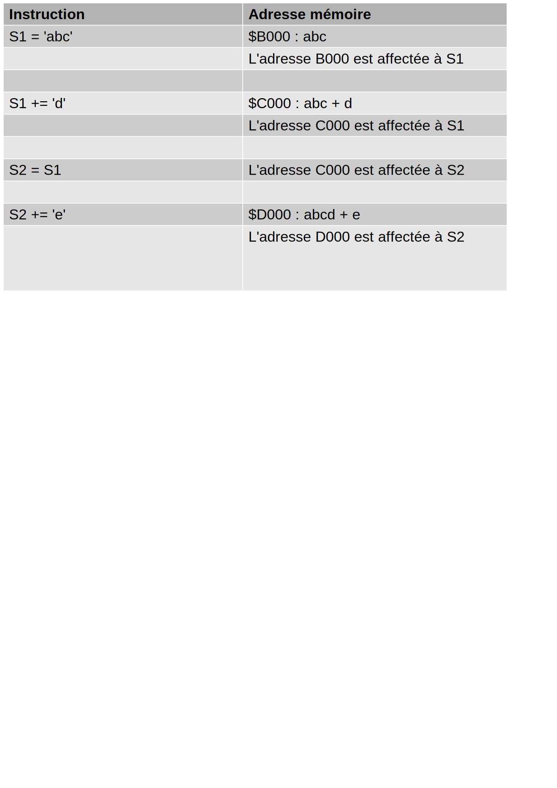

# Initiation au langage Python

.fx: first-page

<!-- formateur@makina-corpus.com -->

--------------------------------------------------------------------------------

<!--## Votre formateur-->

<!--.fx: votre-formateur-->

<!---->

<!---->

<!---->

<!--- Good Guy sera votre  good.guy@makina-corpus.com-->
<!--- Il est gentil et aura le plaisir de vous guider -->
<!--dans la découverte-->
 <!--de ce langage fabuleux...-->

--------------------------------------------------------------------------------

## Plan de formation

.fx: plan-formation

- **Présentation & Historique**
- **Syntaxe et bases du langage**
- Approche Orientée Objet
- Programmation Orientée Objet en Python
- Librairies standard
- Outils de qualité et tests
- IHM TKInter
- Interfaçage avec le langage C

--------------------------------------------------------------------------------

# Présentation et historique

## Pourquoi utiliser python ?

.fx: pourquoi-utiliser-python

--------------------------------------------------------------------------------

### C'est amusant

--------------------------------------------------------------------------------

### C'est efficace

--------------------------------------------------------------------------------

### Il calcule vraiment bien

--------------------------------------------------------------------------------

### Il est élégant

--------------------------------------------------------------------------------

###  Il sait presque tout faire

--------------------------------------------------------------------------------

###  C'est facile

--------------------------------------------------------------------------------

## Historique

- Conçu par Guido Van Rossum 
  Au Centrum voor Wiskunde en Informatica, Pays-Bas 
pour le Système
 d'exploitation Amoeba.
- 1989 : Ecriture de la première version du langage
- 1991 : Première publication en 1991 - v0.9.0
  Souhaite succéder à ABC et remplacer Bourne-Shell.
- 1995 : Guido est employé au CNRI
- 1999 : Le CNRI et l'agence DARPA lancent le projet Computer
 Programming for Everybody (CP4E). 
- Python est retenu pour enseigner la
 programmation

--------------------------------------------------------------------------------

## Historique

- 2000 : Guido travaille pour BeOpen
- 2000 : Création de PythonLab
- 2001 : Création de la Python Sofware Foundation (PSF)
- Décembre 2008 : Version 3.0
- De 2005 à 2012 Guido travaille pour Google
- Il travaille depuis chez Dropbox

> « Et  Google et Dropbox utilisèrent Python… »

--------------------------------------------------------------------------------

## Qui utilise Python ?

Mais il n'y a pas que les sociétés qui emploient Guido qui utilisent
 Python. Il y a aussi :

- L'Agence Spatiale Européenne
- La Nasa
- Airbus
- Le CEA
- Yahoo, Facebook, Amazon, ...
- Les entreprises qui font du chiffrement (Banques, MasterCard, Visa,
 …)
- Les centres de recherche du monde entier
- L'industrie en général

--------------------------------------------------------------------------------

### Les types de projets utilisant Python

Python est fourni avec un ensemble de librairies couvrant la plupart
 des besoins en informatique (base de données, gestion de fichiers,
 calcul, chiffrement, réseau, …).

Mais il s'illustre particulièrement dans les domaines:

- du calcul scientifique,
- de l'administration système,
- d'Internet et la sécurité (réseaux),
- du traitement de documents textes, notamment en XML

_S'il est moins concis que Perl il gère beaucoup mieux les spécificités de chaque
langue, notamment les jeux de caractères internationaux._

--------------------------------------------------------------------------------

### Quelques Projets en Python

- La suite concurrente de Matlab/Mathematica/S-Plus :
 **Scipy**
<http://scipy.org/> 
- Les outils d'administration système : **Fabric**, **Ansible** et
 **Salt**
<http://www.fabfile.org/>, <http://www.ansible.com,> 
 <http://saltstack.com/> 
- Internet et les réseaux : **Django**, **Plone**, **Flask**,
 **Twisted**
<http://djangoproject.com>, <http://plone.org>,
 <http://flask.pocoo.org/>, <https://twistedmatrix.com/> 
- Applications mobile : **Kivy**
<https://kivy.org> 
- Le calcul distribué : **PySpark**,
 **mr.job**
<https://spark.apache.org/docs/0.9.0/python-programming-guide.html>
- Physique : **Code Aster**, **Salome Meca**
<http://www.code-aster.org/> 

Et il y en a beaucoup d'autres :
 <https://github.com/vinta/awesome-python> 

--------------------------------------------------------------------------------

### PyPI

Si la librairie standard de Python ne vous suffit pas, le site PyPI
 contient une liste quasi exhaustive de tous les projets Python open
 source avec toutes leurs versions.

PyPI est l'équivalent du CPAN du langage Perl.

- Librairie standard 
<https://docs.python.org/3/library/>
- PyPi, Python Package Index 
<https://pypi.python.org/> 

--------------------------------------------------------------------------------

### Historique des versions

--------------------------------------------------------------------------------

### Quelle version choisir ?

- Deux versions de Python sont aujourd'hui largement utilisées:
    - Python 2
    - Python 3
- D'une manière générale, Python 3 est la dernière version et celle
 officiellement recommandée par la communauté.
- Python 3 a été créé dans le but d'améliorer mais aussi de
 simplifier Python 2 qui proposait beaucoup de librairies/fonctions
 dépréciées, ou existant dans de multiples versions.
- La dernière version de Python dans la série 2 est Python 2.7.
- La version 2.7 n'évoluera plus dans l'avenir sauf pour les
 corrections de bugs et failles de sécurité.

--------------------------------------------------------------------------------

### Pourquoi travailler avec Python 2 ?

- Aujourd'hui une grande partie de l'industrie utilise encore Python 2
 pour trois raisons majeures :
- Le système d'exploitation utilisé ne propose pas Python 3. 
_Python 3
 ne supporte pas certains anciens systèmes d'exploitations comme BeOS,
 Tru64, MacOS 9, RISCOS et Irix (liste non exhaustive).
Les anciennes
 distributions Linux ne proposent pas nativement Python 3_
- Certaines librairies vitales pour le projet n'existent pas encore sous
 Python 3.
- Les projets de ces sociétés ont été écrits avec Python 2 et il
 n'est pas justifié de migrer le projet en regard des coûts induits
 et/ou des risques de régression.

--------------------------------------------------------------------------------

### Pourquoi travailler avec Python 3 ?

Si votre projet ne se place dans aucun de ces 3 cas, autrement dit :

- que c'est un nouveau projet, 
- qu'il sera exécuté sur un système compatible avec Python 3,
- qu'il n'utilise pas de librairie non compatible avec Python 3
<http://python3wos.appspot.com/>,

**utilisez Python 3**, à défaut essayez d'utiliser Python 2.7.

--------------------------------------------------------------------------------

### Pourquoi travailler avec Python 3 ?

Python 3 est aussi réputé pour être plus performant et améliorer :

- La gestion des exceptions
- La gestion des chaînes de caractères et données binaires
- La gestion des threads
- La programmation asynchrone

Quelques liens qui vous aideront à faire votre choix :

- <http://fr.wikipedia.org/wiki/Python_%28langage%29>#Python_3000
- <http://wiki.python.org/moin/Python2orPython3>
- <http://docs.python.org/3/whatsnew/3.0.html> 

--------------------------------------------------------------------------------

### Travailler avec les 2 versions de Python

- Le livre de migration de Python 2 à 3 : 
 <http://www.python3porting.com> 
- La librairie Six, permettant d'écrire un code cross-version plus
 facilement : 
 <http://pythonhosted.org/six/> 
- La librairie future, moins répandue mais prometteuse : 
 <http://python-future.org/overview.html> 

--------------------------------------------------------------------------------

### Site officiel

Le site officiel du langage Python est **Python.org** 
<https://www.python.org>

Si vous n'avez pas encore installé votre version de Python,
 téléchargez là depuis cette URL: 
<https://www.python.org/download>

Et en route pour l'aventure…

 

--------------------------------------------------------------------------------

### Qualités du langage

- **Interprété** 
  Il est facile de tester un petit bout de code.
- **Orienté objet** 
  Il implémente l'essentiel de la mécanique POO.
- **Haut niveau**: 
  Il est Facile d'écrire des tâches complexes.
- **À syntaxe positionnelle** 
  Plus d'accolade, ça déroute les novices,
  mais à l'usage on trouve cela très bien.
- **Portable** 
  Tout comme Java il génère un bytecode exécutable sur
  n'importe quelle machine pourvue de l'interpréteur. C'est Java qui a
  copié Python !
- **Lisible** 
  Super lisible, vous verrez.
- **Extensible** 
  Notamment avec le langage C
- **Logiciel libre** 
  Géré par une fondation

Vous trouverez d'autres raisons de l'apprécier
 ici: <http://www.linuxjournal.com/article/3882> 

--------------------------------------------------------------------------------

### Défauts du langage

- **Lent**.
C'est son principal défaut. Peut se compenser en développant
 des modules C, mais ce n'est plus du Python. Pas de compilateur natif.
 Il y a par contre beaucoup de compilateurs « on the fly ».
- **Typage moins strict**.
Pour les puristes de l'objet c'est une hérésie,
 pour les autres c'est plutôt carrément cool.
- **Absence de pointeur**.
Impossible de manipuler la mémoire ou les
 registres du processeur sans passer par des librairies annexes ou
 développer des modules en C. Difficile de piloter du matériel si une
 librairie n'est pas fournie ou s'il n'utilise pas une interface
 standard.
- **Difficile de masquer son code**.
On peut toujours récupérer les sources
 mêmes depuis un PYC. Compliqué pour la propriété intellectuelle.
- Et il y en a
 d'autres
<http://web.archive.org/web/20031002184114/www.amk.ca/python/writing/warts.html>

Mais
 globalement c'est un excellent langage que peu d'autres langages
 arrivent à égaler

--------------------------------------------------------------------------------

### Diminution des coûts de développement

Une comparaison de Python avec quelques autres langages peut-être
consultée à cette URL :

<https://www.python.org/doc/essays/comparisons/>

- La syntaxe très épurée, claire et performante de Python en fait un
 langage extrêmement efficace.
- Généralement un programme Python comporte 3 à 5 fois moins de
 lignes de code que son équivalent Java pour réaliser la même tâche.
- Il demandera aussi environ 5 fois moins de temps de
 développement.

<https://pythonconquerstheuniverse.wordpress.com/2009/10/03/python-java-a-side-by-side-comparison/>
 

--------------------------------------------------------------------------------

## Plusieurs Python : **CPython**

Il n'y a pas qu'une implémentation de Python.

La version officielle du site Python.org est appelée CPython parce
 qu'elle implémente le cœur du langage et de certaines librairies en
 **langage C**

--------------------------------------------------------------------------------

### Plusieurs Python : **Stackless Python**

- Bien que ce ne soit pas la version la plus connue, elle a su apporter
 des améliorations importantes, notamment un système de microthreads.
- Le cœur des fonctionnalités de Stackless a été exporté dans la
 librairie Greenlet sur laquelle s'appuient aujourd'hui de nombreux
 projets.

--------------------------------------------------------------------------------

### Plusieurs Python : **Jython**

Jython est une version du langage Python, écrite non pas en C mais en
 **Java**.
 
Jython permet notamment :

- de compiler le code source Python en bytecode Java (.class),
- d'utiliser les librairies Java dans le code Python,
- d'utiliser les librairies Python dans le code Java,
- d'utiliser les threads Java et son garbage collector.

--------------------------------------------------------------------------------

### Plusieurs Python : **Iron Python**

IronPython est une implémentation de Python pouvant s'intégrer avec
 l'environnement **.NET** de Microsoft
 
Il permet notamment :

- d'utiliser le Framework .NET avec Python 
- une meilleur gestion du multithreading car n'utilise pas le GIL,
- peut fonctionner dans des navigateur avec Silverlight

--------------------------------------------------------------------------------

### Plusieurs Python : PyPy

PyPy est **une implémentation de Python en Python**.
Initialement de 400 à 2000 fois plus lent que Python il est
 aujourd'hui devenu bien plus rapide (x10).
 
Il permet notamment :

- De modifier le comportement de l'interpréteur à l'exécution
- De modifier les méthodes des classes de base  
- Offre un compilateur JIT
- Meilleure gestion de threads grâce à l'usage des librairies de
 Stackless Python
> “If you want your code to run faster, you should probably just use
 PyPy."
<cite>Guido van Rossum</cite>

--------------------------------------------------------------------------------

## Prise en mains

Pour démarrer l'interpréteur, tapez la commande:

    !bash
    
    $ python2
    Python 2.7.6 (default, Jun 22 2015, 17:58:13) 
    [GCC 4.8.2] on linux2
    Type "help", "copyright", "credits" or "license" for more
    Information.
    >>>

<!-- -->
    !bash
        
    $ python3
    Python 3.4.0 (default, Jun 19 2015, 14:20:21) 
    [GCC 4.8.2] on linux
    Type "help", "copyright", "credits" or "license" for more
    information.
    >>>

<!-- -->     
    !bat
    
    c:\\>c:\\Python34\\python.exe
    Python 3.4.3 (v3.4.3:9b73f1c3e601, Feb 24 2015, 22:43:06) [MSC v.1600
    32 bit (Intel)] on win32
    Type "help", "copyright", "credits" or "license" for more
    information.
    >>>

--------------------------------------------------------------------------------

### Hello World dans l'interpréteur

    !python
    >>> print("Bonjour la planète !")
    Bonjour la planète !
    >>> 2 + 2
    4
    >>> "Hello World"
    'Hello World'

L'interpréteur affiche le résultat d'une expression qui n'est pas
 affectée à une variable, pas besoin de print lorsque vous êtes en
 ligne de commande.

--------------------------------------------------------------------------------

### Que faire dans l'interpréteur ?

Il sert surtout à tester rapidement un bout de code.

Après, c'est écrit dedans :
    
    !bash
   
    Python 3.4.0 (default, Jun 19 2015, 14:20:21) 
    [GCC 4.8.2] on linux
    Type "help", "copyright", "credits" or "license" for more
    information.

--------------------------------------------------------------------------------

### Que faire dans l'interpréteur ?
        
    Python 3.5.2 |Anaconda 4.1.1 (64-bit)| (default, Jul  2 2016, 17:53:06) 
    [GCC 4.4.7 20120313 (Red Hat 4.4.7-1)] on linux
    Type "help", "copyright", "credits" or "license" for more information.
    >>> help
    Type help() for interactive help, or help(object) for help about object.
    >>> help()
    
    Welcome to Python 3.5's help utility!
    
    If this is your first time using Python, you should definitely check out
    the tutorial on the Internet at http://docs.python.org/3.5/tutorial/.
    
    Enter the name of any module, keyword, or topic to get help on writing
    Python programs and using Python modules.  To quit this help utility and
    return to the interpreter, just type "quit".
    
    To get a list of available modules, keywords, symbols, or topics, type
    "modules", "keywords", "symbols", or "topics".  Each module also comes
    with a one-line summary of what it does; to list the modules whose name
    or summary contain a given string such as "spam", type "modules spam".
    
    help> 

--------------------------------------------------------------------------------

### Exercice

- Afficher la liste des mots clef du langage
- Afficher la liste des fonctions applicables sur une chaîne de
 caractères
- Mettre en majuscules la chaîne « Hopla »
- Quitter l'interpréteur

--------------------------------------------------------------------------------

### Premier script

Bien sûr un programme en Python ne se crée pas via l'interpréteur.

Vous pouvez saisir des instructions dans un fichier texte.

Par convention l'extension du fichier est " .py " 
  _Ce n'est qu'une convention_

Vous exécutez le fichier avec la commande :

    !bash
    python <nom du fichier .py>

#### Exercice
 Affichez le résultat de 2+2 dans la console

--------------------------------------------------------------------------------

### Premier script – bonjour.py

    !python
    print('Bonjour la planète')
    2 + 2
    'Hello World'

<!-- -->

    !bash
    gedit bonjour.py
    python3 bonjour.py
    Bonjour la planète
    
    
Contrairement à l'interpréteur, dans un script ces mêmes commandes
 n'affichent pas les 2 dernières lignes.

Dans un script il faut impérativement utiliser 'print' pour afficher
 un message

Ce n'est pas une erreur de syntaxe que de saisir une opérande sans
 l'affecter à une variable. 
 Elle est évaluée, stockée en mémoire et c'est tout – Déroutant !

--------------------------------------------------------------------------------

### Premier script – bonjour.py
    
    !bash
    $ python2 bonjour.py 
    File "bonjour.py", line 1
    SyntaxError: Non-ASCII character '\\xc3' in file bonjour.py on line 1,
    but no encoding declared; see <http://www.python.org/peps/pep-0263.html>
    for detail

<!-- -->

    !python
    # coding=utf8
    # OU
    # -*- coding : utf-8 -*-
    print('Bonjour la planète')
    print 'Bonjour la planète'

En Python3 un script est considéré comme étant écrit avec le jeu
 de caractères **unicode**, qui reconnait tous les caractères de toutes les
 langues du monde.

Python2 considère que c'est de l'**ASCII** par défaut et
 ne tolère pas les accents.

Avec Python 2, les parenthèses ne sont pas requises après print

Avec Python 3, elles sont obligatoires : 
print n'est plus un mot clef, mais est devenu une fonction

--------------------------------------------------------------------------------

### Rendre un script exécutable

Pour rendre un script exécutable, il faut :

Comme avec bash, Perl, et plein d'autres langages interprétés,
 ajouter sur sa première ligne, sous forme de commentaire, le chemin
 vers l'exécutable (**shebang**)
 
    !python
    #!/usr/bin/python3
    #!C:\\Python3\\python.exe
    
Rendre le script exécutable sous Unix

    !bash
    chmod +x bonjour.py
    ./bonjour.py 
    Bonjour la planète

--------------------------------------------------------------------------------

## Les éditeurs Python

L'idéal est de développer avec un IDE  (Integrated Development
 Environment). Il en existe tout plein :
 
- PyCharm 
<https://www.jetbrains.com/pycharm/> 
- Eclipse + Pydev ou Aptana Studio 
<http://www.pydev.org/> 
 <http://www.eclipse.org/> 
<http://www.aptana.com>  
- Spyder – pour ceux qui calculent 
<https://github.com/spyder-ide/spyder> 
- Geany 
<http://www.geany.org/> 
- Sublime Text 
<https://www.sublimetext.com/> 
- Wingware IDE 
<https://wingware.com/> 
- Comparatif de nombreux IDE pour Python 
<https://en.wikipedia.org/wiki/Comparison_of_integrated_development_environments#Python>
<http://stackoverflow.com/questions/81584/what-ide-to-use-for-python>
  

--------------------------------------------------------------------------------

### TP : utiliser PyCharm

- Lancer PyCharm
- Créer un nouveau projet : « formation »
- Créer un fichier « hello-world.py » qui affiche « Bonjour tout
 le monde ! »
- L'exécuter dans PyCharm avec le menu « Run... » !

--------------------------------------------------------------------------------

.fx section-first-page

# Syntaxe et bases du langage

Les variables, types de données et structures de contrôle

--------------------------------------------------------------------------------

## Références, PEPs

- Le langage Python est défini par sa syntaxe/grammaire 
_Comme tout langage direz-vous !_ 
Elle est accessible à cette URL :
<https://docs.python.org/3/reference/index.html> 
- Il évolue en suivant des **PEPs**: Python Enhancement Proposals
<https://www.python.org/dev/peps/>
les PEPs sont à Python ce que les RFC sont à Internet
- Les PEPs qu'il est recommandé de lire sont à minima
    - La PEP8 : Conventions
     d'écriture
    <https://www.python.org/dev/peps/pep-0008/> 
    - La PEP257 : Les docstrings
    <https://www.python.org/dev/peps/pep-0257/>
     

--------------------------------------------------------------------------------

## Plan de formation

- Les principaux types de données et structures de contrôle
    - Les variables et le typage
    - None
    - Les chaînes de caractères
    - Les nombres
    - Les booléens
        - Les opérateurs de comparaison
        - les structures conditionnelles : if/else et while
    - Les séquences
        - Les listes et les tuples
        - La boucle for
        - Les listes par compréhension
    - Les dictionnaires, tableaux associatifs

--------------------------------------------------------------------------------

## Les types de données et les variables

- Le typage des variables est dynamique
    - Il n'est pas nécessaire de les déclarer:
      Déclarer une variable c'est lui affecter une valeur
      `>>> a = 20`
    - **Réaffecter** une variable est différent de **modifier** une variable 
      `>>> a = a + 1  # réaffectation de la variable`
      `>>> maliste.sort()  # modification de la variable`
    - Il y a des conversions implicites de types (entier + flottant =
        flottant)
    - Toutes les conversions implicites ne sont pas permises (chaîne +
      entier provoque une erreur)
- La copie de valeurs entre variables se fait par référence, comme en
 Java.
- Python n'a pas de type primitifs comme en C++/Java.
Il est **totalement objet**.

--------------------------------------------------------------------------------

### Les types de données

- En Python il existe :
    - Les types **modifiables**, souvent appelés mutable objects
    - Les types **non modifiables**, appelés non mutable objects, ou immutable objects
- La fonction « type() » permet de connaître le type d'une variable ou opérande
 
<!-- -->
    !python
    >>> type("Hello world")
    str

--------------------------------------------------------------------------------

### Expressions / instructions

- **ATTENTION**, selon l'instruction utilisée :
    - Soit la variable est modifiée et aucune valeur n'est retournée: 
     `maliste.append(10)`
    - Soit la variable n'est pas modifiée et une valeur est
      retournée: 
      `machaine.upper()`
- Pour le savoir, il convient de faire un **help** sur la fonction.
- En général, sur les types non modifiables, les fonctions retournent
 une valeur tandis que sur les types modifiables, c'est la variable qui
 est modifiée.

--------------------------------------------------------------------------------

## Les types de données : **None**

- La constante « None » est utilisée pour indiquer qu'une variable
 n'a pas de valeur d'affectée
- C'est l'équivalent de « NULL » en C++ ou « null » en Java ou
 encore « nil » en Pascal et Lisp

--------------------------------------------------------------------------------

## Les chaînes de caractères - Syntaxe

Il y a quatre manières d'écrire une chaîne de caractères :
    
    !python
    "Entre guillemets"
    'Entre apostrophes'
    """Entre triples guillemets"""
    '''Entre triples apostrophes'''

- Les deux premières notations sont équivalentes
- Les deux dernières aussi
- Les deux dernières notations sont appelées « docstrings » et
 jouent un rôle très particulier dans le langage. 
Pour la documentation, pour les tests, elles sont très spéciales...

--------------------------------------------------------------------------------

### Les chaînes de caractères - Syntaxe

Le choix des apostrophes ou les guillemets est surtout pratique :

    !python
    >>> s1 = "Il est plus facile d'écrire des apostrophes"
    >>> s2 = 'entre guillemets qu\'entre apostrophes'
    >>> s3 = 'Inversement, il est plus facile de saisir un guillemet "
        entre apostrophes'
    >>> s4 = "qu'entre guillemets \" : c'est la seule raison"

- Le caractère « \\ » est appelé le caractère d'échappement.
- Comme dans presque tous les langages, il permet:
    - de protéger les caractères spéciaux, comme les guillemets et
      apostrophes,
    - de marquer des caractères invisibles.
 

--------------------------------------------------------------------------------

### Les chaînes de caractères - Syntaxe

Le choix des apostrophes ou les guillemets est surtout pratique :

    !python
    >>> s1 = "Il est plus facile d'écrire des apostrophes"
    >>> s2 = 'entre guillemets qu\'entre apostrophes'
    >>> s3 = 'Inversement, il est plus facile de saisir un guillemet "
        entre apostrophes'
    >>> s4 = "qu'entre guillemets \" : c'est la seule raison"

- Les équipes de développement ont souvent leurs conventions maison.
- En général, les chaînes destinées à être affichées sont entre
 guillemets, les chaînes utiles pour le programme seulement (clés,
 identifiants…) entre apostrophes.

--------------------------------------------------------------------------------

### Les chaînes de caractères - Syntaxe

Les chaînes avec triple délimiteur permettent de saisir du texte sur
plusieurs lignes
 
    !python
    In [0]: loup_agneau = """
       ...: Le Loup et l'Agneau
       ...: 
       ...:     La raison du plus fort est toujours la meilleure :
       ...:     Nous l'allons montrer tout à l'heure
       ...: """
    In [1]: print(loup_agneau)

    Le Loup et l'Agneau
    
        La raison du plus fort est toujours la meilleure :
        Nous l'allons montrer tout à l'heure

--------------------------------------------------------------------------------

### Les chaînes : les caractères spéciaux

- Les principaux caractères spéciaux :
    - **\\n** : Le saut de ligne
    - **\\r** : Le retour chariot
    - **\\t** : La tabulation
    - **\\\\** : Le caractère « \\ »
- La liste complète est fournie à cette  URL 
  <https://docs.python.org/3/reference/lexical_analysis.html#literals>

<!-- -->
    !python
    >>> print("Rien ne sert de courir\\nIl faut partir à point")
    Rien ne sert de courir
    Il faut partir à point

--------------------------------------------------------------------------------

### Les chaînes : l'échappement

Les chaînes délimitées par des guillemets ou apostrophes peuvent
aussi s'écrire sur plusieurs lignes :
 
    !python
    A = "Une chaine sur\\
    plusieurs lignes"
    
ATTENTION : Pas d'espace après « \\ »

On peut préfixer une chaîne par « r » ce qui signifie que les
 caractères sont pris tels quels (mode raw) :
 
    >>> print("Un\tdeux\nTrois")
    Un deux
    Trois
    >>> print(r"Un\tdeux\nTrois")
    Un\tdeux\nTrois

--------------------------------------------------------------------------------

### Les chaînes de caractères - Formatage

Contrairement à Perl et Bash, les variables ne sont pas
 interprétées en Python lorsqu'elles sont précédées du symbole
 « $ »

#### Bash ou Perl

    !perl
    $ a = "toto"
    $ echo 'Je suis $a'
    Je suis $a
    $ echo "Je suis $a"
    Je suis toto

#### Python

    !python
    # Python
    >>> a = "toto"
    >>> print("Je suis $a")
    Je suis $a
    >>> print('Je suis $a')
    Je suis $a
    Bash ou Perl
    Python

Les notations « " » et « ' » sont vraiment identiques.

--------------------------------------------------------------------------------

### Les chaînes de caractères - Formatage

Il existe plusieurs manières de formater une chaîne avec des variables :

Avec l'opérateur « + » :

    !python
    print("M. et Mme : " + nom + " ont un fils : " + prenom)

Avec une liste de paramètres entre parenthèses

    !python
    print("M. et Mme : %s ont une fille :  %s" % (nom, prenom) )
    
Avec la fonction « format »
    
    !python
    print("Je vis entre {0} et {1} mais je préfère {0}".format(ville_preferee, autre_ville))
    
<http://makina-corpus.com/blog/metier/2016/the-worlds-simplest-python-template-engine>

Avec des dictionnaires 
  _Nous le verrons plus tard_

<https://docs.python.org/3/library/string.html#string-formatting>
 

--------------------------------------------------------------------------------

### Les chaînes de caractères - Opérateurs

Pour concaténer : opérateur « + »

    !python
    >>> print("Le loup " + "et l'agneau")
    Le loup et l'agneau
    >>> d = "Le loup "
    >>> c = d + "et l'agneau"

Pour dupliquer : opérateur « * » :
    
    !python
    >>> print('ABC' * 3)
    ABCABCABC

--------------------------------------------------------------------------------

### Les chaînes de caractères - Indexation

- On peut accéder aux caractères d'une chaîne par indice
- La notation est 
  `<variable>[<indice debut>:<indice fin exclu>:<pas>]`
- Les 3 paramètres entre crochets sont facultatifs, mais il doit y en
  avoir au moins
- L'indice de début commence à 0
- Les « indices » et le « pas » peuvent être négatifs
- La longueur de la chaîne est fournie par la fonction len

<!-- -->
    !python
    >>> len('Jean de la Fontaine')
    19

--------------------------------------------------------------------------------

### Les chaînes de caractères - Indexation

    !python
    >>> s = "ABCDEFGHIJKLMNOP"
    >>> s[0]
    'A'
    >>> s[5:8]
    'FGH'
    >>> s[1:8:2]
    'BDFH'
    >>> s[-1]
    'P'
    >>> s[-3:-1]
    'NO'
    
Exercices :

- extraire dans « Jean de la Fontaine » : **« Jean »**,
  **« de la »** et **« Fontaine »**
- Inverser une chaîne de caractères en utilisant la notation indiciaire

--------------------------------------------------------------------------------

### Chaînes de caractères – Non mutable

Une chaîne n'est pas modifiable

    !python
    >>> a = "ABCDEF"
    >>> a[0] = 'a'
    Traceback (most recent call last):
    File "<stdin>", line 1, in <module>
    TypeError: 'str' object does not support item assignment

--------------------------------------------------------------------------------

### Retrouver les méthodes disponibles: **dir**

- Parmi les fonctionnalités d'introspection de Python figure la
 fonction « dir » qui permet de savoir tout ce que l'on peut faire
 avec une variable OU une opérande
- Python peut s'étudier lui-même, on appelle cela l'introspection

    !python
    >>> print( dir("toto") )
    ['__add__', '__class__', '__contains__', '__delattr__', '__dir__',
    '__doc__', '__eq__', '__format__', '__ge__', '__getattribute__',
    '__getitem__', '__getnewargs__', '__gt__', '__hash__', '__init__',
    '__iter__', '__le__', '__len__', '__lt__', '__mod__', '__mul__',
    '__ne__', '__new__', '__reduce__', '__reduce_ex__', '__repr__',
    '__rmod__', '__rmul__', '__setattr__', '__sizeof__', '__str__',
    '__subclasshook__', 'capitalize', 'casefold', 'center', 'count',
    'encode', 'endswith', 'expandtabs', 'find', 'format', 'format_map',
    'index', 'isalnum', 'isalpha', 'isdecimal', 'isdigit', 'isidentifier',
    'islower', 'isnumeric', 'isprintable', 'isspace', 'istitle', 'isupper',
    'join', 'ljust', 'lower', 'lstrip', 'maketrans', 'partition', 'replace',
    'rfind', 'rindex', 'rjust', 'rpartition', 'rsplit', 'rstrip', 'split',
    'splitlines', 'startswith', 'strip', 'swapcase', 'title', 'translate',
    'upper', 'zfill']

--------------------------------------------------------------------------------

### Retrouver les méthodes disponibles : **dir**

La fonction `dir` retourne tous les attributs et toutes les
 fonctions applicables à l'objet (variable/opérande) étudié

Tout ce qui commence par un double underscore (tiret bas) 
« __ »
 est relatif au modèle objet de Python et peut être ignoré pour le
 moment

Tout le reste est « applicable » à l'objet étudié. Vous pouvez donc écrire :

    !python
    >>> help("toto".upper)  # sans les parenthèses
    
Puis quand vous savez ce que cela fait
    
    !python
    >>> "toto".upper()
    TOTO

--------------------------------------------------------------------------------

### Chaînes de caractères : Exercices

Soit la variable 

    !python
    A = "ABCDEF"

Modifiez la variable **A** pour que son premier caractère soit converti
 en minuscules

--------------------------------------------------------------------------------

## Les nombres

Il existe 3 types de nombres en Python :

### Les entiers

    !python
    >>> e = 10
    
### Les réels
    
    !python
    >>> r = 10.0
    
### Les complexes

    !python
    >>> c = 0 + 1j
    >>> print(c * c)
    
ATTENTION aux problèmes d'arrondis et pertes de
précisions

- <https://docs.python.org/3.5/tutorial/floatingpoint.html>
- <https://fr.wikipedia.org/wiki/Virgule_flottante#Norme_IEEE_754>
- <https://docs.oracle.com/cd/E19957-01/806-3568/ncg_goldberg.html>

--------------------------------------------------------------------------------

### Les nombres - opérateurs

- « + » : addition
- « - » : soustraction
- « / » : division
- « * » : multiplication
- « // » : division entière
- « ** » : puissance, exposant
- « % » : reste de la division
- « & » : ET bit à bit
- « | » : OU bit à bit
- « ^ » : OU exclusif bit à bit

<https://docs.python.org/3/library/math.html> 

--------------------------------------------------------------------------------

### Les nombres – différences Python 2/3

#### En Python 3, tous les entiers sont longs.
Leur taille n'est limitée que par la taille de la mémoire de l'ordinateur

#### En Python 2, il y a 2 types d'entiers :

Les entiers courts, dont la taille maximale est donnée par le module
 `sys`

    !python
    >>> import sys
    >>> sys.maxint
    9223372036854775807

Les entiers longs. Ils sont suffixés par un `L`.
    
    !python
    >>> a = 10L

--------------------------------------------------------------------------------

### Les nombres – différences Python 2/3

#### En Python 3 la division retourne le véritable résultat

    !python
    >>> 10 / 3
    3.33333
    >>> 10.0 /3
    3.33333

#### En Python 2 la division retourne un résultat typé

    !python
    >>> 10 / 3
    3
    >>> 10.0 / 3
    3.33333 

--------------------------------------------------------------------------------

### Les nombres – formatage

- `%s` n'est pas le seule marqueur d'interpolation,
- `%f` et `%d` permettent de formater des nombres

#### Exercice
Soient trois prix inférieurs à 100 000 euros, par exemple :
   
   
    !python
    p1, p2, p3 = 2000, 10.95, 5

   
Écrivez une instruction qui les affiche bien alignés :

    !python
    2000.00 €
      10.95 €
       5.00 €

--------------------------------------------------------------------------------

### Les nombres – les bases

- En python, les nombres sont en base 10 par défaut.
- Des préfixes permettent d'exprimer les nombres dans différentes
 bases :

<!-- -->
    !python
    >>> 0b101  # binaire
    5
    >>> 0o12    # octal
    10
    >>> 0x4d8  # hexadecimal
    1240
    
Les méthodes bin(), oct, hex() permettent de convertir vers une
chaîne de caractères

--------------------------------------------------------------------------------

### Les nombres – les réels

Le module `sys` fournit des informations sur les réels :

    !python
    >>> import sys
    >>> sys.float_info
    sys.float_info(max=1.7976931348623157e+308, max_exp=1024,
    max_10_exp=308, min=2.2250738585072014e-308, min_exp=-1021,
    min_10_exp=-307, dig=15, mant_dig=53, epsilon=2.220446049250313e-16,
    radix=2, rounds=1)

--------------------------------------------------------------------------------

## Les booléens

Les variables de ce type ne peuvent avoir que l'une des 2 valeurs :
 
- `True`
- `False`
 

--------------------------------------------------------------------------------

### Les opérateurs booléens

Trois opérateurs sont disponibles, et sont, par ordre de priorité :

- `or`
- `and`
- `not`

Les opérateurs « `or` » et « `and` » sont dit progressifs.
Ils s'arrêtent dès que le résultat est connu

Dans `a or b or c or d` si « a » vaut True, l'évaluation s'arrêtera là.

Dans `a and b and c and d` si « a » vaut False, idem.

Les opérateurs retournent toujours une de leurs opérandes : celle
 ayant permis de définir le résultat

--------------------------------------------------------------------------------

### Opérandes non booléennes

Les opérateurs booléens peuvent s'utiliser avec des opérandes non
 booléennes.
 
Dans ce cas, sont considérés comme valant False:

- `None`
- Une chaîne vide : `''` ou `""` ou `""""""`
- Une liste ou un tuple vide : `[]` ou `()`
- Un dictionnaire vide : `{}`
- Un nombre nul : `0` ou `0.0` ou `0 + 0j`
- Tout le reste est considéré comme valant `True`

--------------------------------------------------------------------------------

### Les booléens - Exemples

_Avez-vous été attentif ?_

Quel est le résultat des opérations suivantes :

    !python
    >>> False or True
    >>> True and False
    >>> not(False)
    >>> 'toto' and None
    >>> 0 or 10
    >>> 'deux' and 'trois'
    >>> not({})
    >>> None or 'toto' or 'tutu'

--------------------------------------------------------------------------------

### Les booléens - Exemples

_Avez-vous été attentif ?_

    !python
    >>> False or True
    True
    >>> True and False
    False
    >>> not(False)
    True
    >>> 'toto' and None
    >>> 0 or 10
    10
    >>> 'deux' and 'trois'
    'trois'
    >>> not({})
    True
    >>> None or 'toto' or 'tutu'
    'toto'
    >>> 1 and True
    True

--------------------------------------------------------------------------------

### Les booléens - Exercice

Il n'y a pas d'opérateur « `xor` » pour le OU exclusif en Python

À l'aide des opérateurs « `and` », « `or` » et « `not` »
 écrivez une expression booléenne équivalent à l'opérateur
 « xor » entre 2 variables a et b.

La table de vérité de `a xor b` est donnée ici :

- True xor True => False
- True xor False => True
- False xor True => True
- False xor False => False

--------------------------------------------------------------------------------

### Booléens : opérateurs de comparaison
    
    !python
    A == B  # A égal B
    A != B  # A est différent de B
    A >= B  # A est supérieur ou égal à B
    A <= B  # inférieur ou égal
    A > B   # A est strictement supérieur à B
    A < B   # strictement inférieur
    A is B  # les variables A et B sont identiques ( même id() )
    A is not B  # les variables A et B sont différentes (id() différent)
    A in B  # A est une valeur de la séquence B
    A not in B  # A n'est pas une valeur de la séquence B

Une opération de comparaison est évaluée en booléen.

--------------------------------------------------------------------------------

## Structures de contrôle – `if`, `elif`, `else`

- La structure de contrôle « `if`, `elif`, `else` » permet d'exécuter
 des instructions conditionnellement.
- Les mots clefs « `if` » et « `elif` » sont suivis d'une expression
 booléenne qui peut inclure des opérateurs de comparaison
`(a and b) or  (c > d * 2)`
- Les mots clefs « `elif` » et « `else` » sont facultatifs
- « `elif` » peut être présent plusieurs fois
- « `else` » ne peut être présent qu'une seule fois en fin de test

--------------------------------------------------------------------------------

### Structures de contrôle – `if`, `elif`, `else`

    !python
    prenom = "Sophie"
    if prenom == "Anne":
        print("Son nom est Durand")
    elif prenom == "Paul":
        print("Son nom est Dupond")
    elif prenom == "Julie":
        print("Son nom est Martin")
    else:
        print("Je ne connais pas de personne se prénommant " + prenom)

--------------------------------------------------------------------------------

### Structures de contrôle – `if`, `elif`, `else`

ATTENTION !

Une opération booléenne ne renvoit pas forcément un booléen.

Donc n'écrivez pas
    
    !python
    resultat = a or b or (c * 2 < d / 10) or (e > "toto")
    if resultat == True :
      print('Résultat est considéré comme valant vrai')

Mais :

    !python
    resultat = a or b or (c * 2 < d / 10) or (e > "toto")
    if resultat :
        print('Résultat est considéré comme valant vrai')

En gros, ne pas confondre :

    !python
    resultat = "toto"
    bool(resultat) == True  # C'est vrai, donc "if resultat" passe !
    resultat == True        # Ca n'est pas vrai, donc "if resultat == True" ne passe pas !

--------------------------------------------------------------------------------

### Structures de contrôle – `if`, `elif`, `else`

Écriture condensée de l'affectation conditionnelle de variables:

`< variable > = < expression > if < expression > else < expression >`

    !python
    nb_jours = 365 if annee == "bissextile" else 364

--------------------------------------------------------------------------------

## Structures de contrôles – boucle `while`

- La boucle `while` permet d'exécuter un bloc de code tant qu'une
  expression est vraie.
- Le mot clef `while` est suivi obligatoirement d'une expression
- La boucle `while` peut contenir les mots clefs `break` et
  `continue` comme pour la boucle `for`
- Elle peut être suivie d'une instruction `else` comme pour la
  boucle `for`

--------------------------------------------------------------------------------

### Structures de contrôles – boucle `while`

    !python
    v = 1
    while v <= 9:
        if (v == 1):
            print("Premier élément")
        elif (v == 3):
            print("v vaut 3")
        elif v == 4:
            continue  # ATTENTION : boucle infinie
        elif v == 6:
            break
        else:
            print("v = " + str(v))
        v += 1
    else:
        print("Fin de la boucle si pas d'interruption avant la fin des éléments")

--------------------------------------------------------------------------------

### Structures de contrôles – fâchons-nous

- Python a quand même quelques vilains défauts
- Il ne propose pas de structure « do… while »
- Il ne propose pas de structure « switch »
- Question : comment les simuleriez-vous ?

--------------------------------------------------------------------------------

## Les listes et tuples

- Les listes et les tuples sont des séquences d'éléments.
- Ils n'ont pas de taille limitée.
- Ils peuvent contenir tout type de données.

<!-- -->
    !python
    >>> l1 = [] # une liste vide
    >>> l2 = [ None, 0, 10.0, "toto", [1,2,'A'], ( 'A', 1) ]
    >>> t1 = () # un tuple vide
    >>> t2 = (None, 0, 10.0, "toto", [1,2,'A'], ( 'A', 1)  )

_Allez faire cela aussi facilement en Java ou C++ !_

- **Ces deux types de données sont similaires... à une différence près !...**

--------------------------------------------------------------------------------

### Les listes et tuples

Seuls les éléments des listes sont modifiables :

    !python
    >>> ma_liste = ['caillou', 'hibou', 'pou', 'chou']
    >>> ma_liste[0] = 'cheval'
    >>> ma_liste
    ['cheval', 'hibou', 'pou', 'chou']
    >>> mon_tuple = ( 'mais',  'où',  'et',  'donc')
    >>> mon_tuple[0] = 'ornicar'
    Traceback (most recent call last):
    File "<stdin>", line 1, in <module>
    TypeError: 'tuple' object does not support item assignment
    
Les **listes** sont **modifiables** (mutable).

Les **tuples** sont non **modifiables** (immutable).

--------------------------------------------------------------------------------

### Les listes et tuples

On peut concaténer des listes et des tuples avec l'opérateur
 `+`

    !python
    >>> (1, 2) + (3, 4)
    (1, 2, 3, 4)

On peut dupliquer les éléments d'un tableau avec l'opérateur `*`

    !python
    >>> (1, 2) * 3
    (1, 2, 1, 2, 1, 2)

--------------------------------------------------------------------------------

### Les listes et tuples – Notation par indices

La notation par indice est aussi utilisable avec les listes et les tuples :

    !python
    >>> ma_liste[1:3]
    ['hibou', 'pou']
    >>> mon_tuple[-1]
    'car'

--------------------------------------------------------------------------------

### Les listes - modifications par indices

Avec les **listes** _mais pas avec les chaînes ni les tuples !_

### Modification
On peut remplacer un sous ensemble
d'éléments par un autre (de longueur différente)

    !python
    >>> a = [0,1,2,3]
    >>> a[1:3] = [4,5,6,7]
    >>> a
    [0, 4, 5, 6, 7, 3]
    >>> a
    [0, 4, 5, 6, 7, 3]
    >>> a[::2] = [0, -1]
    Traceback (most recent call last):
    File "<stdin>", line 1, in <module>
    ValueError: attempt to assign sequence of size 2
    to extended slice of
    size 3
    >>> a[::2] = ['a', 'b','c']
    >>> a
    ['a', 4, 'b', 6, 'c', 3]
    
### Suppression

    !python
    >>> del a[::2]
    >>> a
    [4, 6, 3]

--------------------------------------------------------------------------------

### Les listes et les tuples : Exercices

En partant de la liste suivante :

`['cheval', 'bijou',  'genou', 'caillou', 'pou']`

Obtenez la liste suivante :

`['bijou', 'caillou', 'chou', 'genou', 'hibou', 'joujou', 'pou']`

_Il y a plein de solutions, en utilisant la notation indiciaire, des
 opérateurs, des méthodes ! :D_

--------------------------------------------------------------------------------

### Les listes et les tuples : Exercices

Utilisez les listes pour simuler le fonctionnement d'une **PILE** et d'une
 **FILE**

- Rappel
    - **Pile**, de type LIFO : Last In, First Out 
      Exemple : Une pile d'assiettes
    - **File**, de type FIFO : First In, First Out 
      Exemple : Une file d'attente devant un guichet de caisse
- Écrivez les instructions permettant :
    - d'ajouter des éléments dans une file ou une liste
    - de récupérer la valeur du dernier élément pour la pile et du premier
      élément pour la file et le retirer de cette dernière
- Astuce : n'oubliez pas le `help`

--------------------------------------------------------------------------------

### Les listes et tuples - Décomposition

Il est possible de « décomposer » une liste, autrement dit,
d'affecter son contenu à plusieurs variables :

    !python
    >>> a, b, c = (1, 'A', 3)
    >>> print(a *2,b*3,c*4)
    (2, 'AAA', 8)

--------------------------------------------------------------------------------

### Les listes et tuples - Parcours

Le mot clef `for` permet de parcourir les éléments d'une liste.
- Il retourne directement la valeur de l'élément courant.
- Sans utilisation d'indice.
- Il est semblable au `foreach` de Perl où à la version évoluée de `for`
 introduite en Java 1.5

    !python
    >>> for v in [1,2,'A', 'B']:
    ...     print(v)
    ...
    1
    2
    A
    B
    >>> for a, b in [ (1,2), ('A', 'B'), ( (1,2), "toto") ]:
    ...     print("a=%s, b=%s" % (a,b))
    ...
    a=1, b=2
    a=A, b=B
    a=(1, 2), b=toto

--------------------------------------------------------------------------------

### Les listes et les tuples - Parcours

Si vous avez besoin de connaître l'indice de l'élément courant la
 fonction `enumerate` permet de récupérer les couples (indice, valeur) 

    !python
    >>> for i, v in enumerate("abcdef"):
    ...     print("indice=%s, valeur=%s" % (i,v))
    ...
    indice=0, valeur=a
    indice=1, valeur=b
    indice=2, valeur=c
    indice=3, valeur=d
    indice=4, valeur=e
    indice=5, valeur=f
    
Elle fonctionne avec tout type énumérable / itérable : les chaînes, les listes, les
 tuples, les ensembles, ...

--------------------------------------------------------------------------------

### Les structures de contrôles – la boucle for

- La boucle « for » permet de parcourir les éléments d'une liste
 de valeurs.
- Elle peut se terminer par une instruction « else » qui sera
 exécutée si tous les éléments ont été traités sans interruption
 d'exécution
- Le mot clef « break » dans un for permet de sortir de la boucle
- Le mot clef « continue » permet de passer à l'élément suivant

--------------------------------------------------------------------------------

### Les structures de contrôles – la boucle for

    !python
    for v in [1, 2, 3, 4, 5, 6, 7, 8, 9]:
        if v == 1:
            print("Premier élément")
        elif v == 3:
            print("v vaut 3")
        elif v == 4:
            continue
        elif v == 6:
            break
        else:
            print("v = " + str(v))
    else:
        print("Fin de la boucle si pas d'interruption avant la fin des éléments")

--------------------------------------------------------------------------------

### Listes – Affectation par référence

_Avez-vous étés attentifs ?_

    !python
    >>> l1 = [1,2,3]
    >>> l1.append(4)
    >>> l1
    [1, 2, 3, 4]
    >>> l2 = l1
    >>> l2.append(5)
    >>> l2
    [1, 2, 3, 4, 5]
    >>> l1
    
Que vaut `l1`n ?

--------------------------------------------------------------------------------

### Listes – Affectation par référence

_Avez-vous étés attentifs ?_

    !python
    >>> l1 = [1,2,3]
    >>> l1.append(4)
    >>> l1
    [1, 2, 3, 4]
    >>> l2 = l1
    >>> l2.append(5)
    >>> l2
    [1, 2, 3, 4, 5]
    >>> l1
    [1, 2, 3, 4, 5]
    
L'affectation se fait par référence, 
c'est à dire par copie d'adresse mémoire
NON par duplication de données

`l1` a aussi été modifiée.

C'est valable pour tous les types modifiables.

--------------------------------------------------------------------------------

### Affectation par référence – mutable

--------------------------------------------------------------------------------

### Affectation - Introspection

La fonction `id` permet de connaître l'adresse mémoire d'une variable :
    
    !python
    >>> id(l1)
    140579989015800
    >>> l1.append(4)
    >>> id(l1)
    140579989015800
    >>> l2 = l1
    >>> id(l2)
    140579989015800
    >>> l2 is l1
    >>> True
    >>> "%X" % id(l2)
    '7FDB544ECCF8'
    

--------------------------------------------------------------------------------

### Affectation par référence – immutable

Avez-vous étés attentifs ?

    !python
    >>> s1 = "abc"
    >>> s1 += "d"
    >>> s1
    'abcd'
    >>> s2 = s1
    >>> s2 += 'e'
    >>> s2
    'abcde'
    >>> s1

Que vaut s1 ?

--------------------------------------------------------------------------------

### Affectation par référence – immutable

Avez-vous étés attentifs ?

    !python
    >>> s1 = "abc"
    >>> s1 += "d"
    >>> s1
    'abcd'
    >>> s2 = s1
    >>> s2 += 'e'
    >>> s2
    'abcde'
    >>> s1
    'abcd'
    
Mais l'affectation d'une variable à une expression entraîne une
 nouvelle allocation mémoire. s1 n'a pas été modifiée.
 
l'instruction `s2 += 'e'` a *réaffecté* une valeur la variable s2,
donc créé une nouvelle allocation mémoire

C'est une des principales raisons expliquant la lenteur de
 Python, surtout avec les nombres...

--------------------------------------------------------------------------------

### Affectation par référence – immutable

--------------------------------------------------------------------------------

### Affectation par référence – immutable

Vérification avec `id()` :

    !python
    >>> s1 = 'abc'
    >>> id(s1)
    140579989702736
    >>> s1 += 'd'
    >>> id(s1)
    140579989063360
    >>> s2 = s1
    >>> id(s2)
    140579989063360
    >>> s2 += 'e'
    >>> id(s2)
    140579989063120

--------------------------------------------------------------------------------

### Écriture par compréhension

 
#### Comprehension list

    !python
    >>> [x ** 3 for x in range(10)]
    [0, 1, 8, 27, 64, 125, 216, 343, 512, 729]
    >>> [x ** 3 for x in range(10) if x % 2]
    [1, 27, 125, 343, 729]
    
### Combinaisons
    
    !python
    >>> [(a, x) for x in range(3) for a in "abc"]
    [('a', 0), ('b', 0), ('c', 0), ('a', 1), ('b', 1), ('c', 1), ('a', 2), ('b', 2), ('c', 2)]

#### Exercice : 

Avec une liste par compréhension, générer la liste des pluriels
 de :
 
`['bijou', 'caillou', 'chou']`

--------------------------------------------------------------------------------

### `any` / `all`

Les fonctions `any` et `all` permettent de tester le
 contenu de collections pour savoir si les éléments de ces dernières
 sont considérés comme valant `True` ou `False`

`all` retourne `True` si et seulement si toutes les valeurs de la
 collection son considérées comme vraie
 
    !python
    >>> all((True, (1,), [1,], 1, 1.0, 0+1j, {'a': 1}))
    True

`any` retourne `True` si au moins une des valeurs de la collection
 est considérée comme vraie
 
<!-- -->

    !python
    >>> any((False, () , [], 0,0 + 0j, 0.0, None, {}))
    False
 

--------------------------------------------------------------------------------

### Liste – Affectation par copie

####Exercice

Trouvez un moyen de dupliquer une liste de listes en prenant soin de
 copier chaque sous-liste

Départ :
    
    !python
    A = [[ 'a',  'b',  'c'], [1, 2, 3, 4]]

Arrivée :
    
    !python
    A == B  # est vrai
    A is not B  # est vrai
    A[0] is not B[0]  # est vrai

--------------------------------------------------------------------------------

## Les dictionnaires

- Un **dictionnaire** est un **tableau associatif**.
- On l'appelle aussi table de hachage (Hash table).
- Il stocke des couples (clef, valeur).
- La clef peut-être n'importe quel type NON modifiable.
- La valeur peut-être de n'importe quel type.
- C'est un type modifiable.
- Ils ne sont pas ordonnés, l'ordre de parcours des clefs n'est pas garanti.
 
<!-- -->

    !python
    >>> dico_vide = {}  # un dictionnaire vide
    >>> dico = {
    'Un': 1,
    ('A', '2'): 'Porte avion',
    3.14 : 'PI',
    "liste" : [1,2,3]}

--------------------------------------------------------------------------------

### Les dictionnaires – Utilité et formatage

Les dictionnaires sont très utilisés pour créer rapidement des
 structures de données complexes sans avoir besoin de faire de la
 programmation objet :

    !python
    >>> personne = {'NOM' : 'DURAND', 'PRENOM' : 'Pierre', 'AGE' : 20}
    
Ils peuvent aussi être utilisés pour formater des chaînes :

    !python
    >>> print("Je m'appelle %(NOM)s %(PRENOM)s et j'ai %(AGE)04d ans" % personne)
    Je m'appelle DURAND Pierre et j'ai 0020 ans

--------------------------------------------------------------------------------

### Les dictionnaires

#### Accès à la valeur d'une clef

    !python
    >>> dico[3.14]
    'PI'

#### Modification d'une valeur

    !python
    >>> dico[3.14] = 'Le nombre PI'

#### Ajout d'une nouvelle valeur

    !python
    >>> dico[3.14159] = 'PI avec 5 décimales'

--------------------------------------------------------------------------------

### Les dictionnaires - Parcours

    !python
    >>> dico = {
        'Un': 1,
        ('A', '2'): 'Porte avion',
        3.14 : 'PI',
        "liste" : [1,2,3]}

#### Parcours des clés

    !python
    >>> for key in dico.keys():
    ...     print("clef=%s, valeur=%s" % (key, d2[key]) )
    ...
    clef=liste, valeur=[1, 2, 3]
    clef=('A', '2'), valeur=Porte avion
    clef=Un, valeur=1
    clef=3.14, valeur=PI
    >>> for key in dico:
    ...     print(key)
    ...
    liste
    ('A', '2')
    Un
    3.14
    

--------------------------------------------------------------------------------

### Les dictionnaires - Parcours

#### Parcours des valeurs
    
    !python
    >>> for value in d2.values():
    ...     print(value)
    ...
    [1, 2, 3]
    Porte avion
    1
    PI
    >>> for key, value in dico.items():
    ...     print("clef=%s, valeur=%s" % (key, value) )
    ...
    clef=liste, valeur=[1, 2, 3]
    clef=('A', '2'), valeur=Porte avion
    clef=Un, valeur=1
    clef=3.14, valeur=PI

#### Parcours des éléments

    !python
    >>> for key, value in dico.items():
    ...     print("clef=%s, valeur=%s" % (key, value) )
    ...
    clef=liste, valeur=[1, 2, 3]
    clef=('A', '2'), valeur=Porte avion
    clef=Un, valeur=1
    clef=3.14, valeur=PI

--------------------------------------------------------------------------------

### Les dictionnaires – Accès par clef

L 'accès à une clef qui n'existe pas provoque une erreur

    !python
    >>> d = {}
    >>> a = d['toto']
    Traceback (most recent call last):
    File
    "<stdin>", line 1, in <module>
    KeyError: 'toto'
    
Pour contourner le problème il convient 
soit de tester l'existence de la clef au préalable :
    
    !python
    if 'toto' in d
    if d.has_key('toto') # Python2
    
soit d'utiliser la fonction `get(<key>, 'valeur par défaut si pas trouvée')`
    
    !python
    >>> a  = d.get('toto', None)

--------------------------------------------------------------------------------

### Les dictionnaires – Suppression d'un clef

Le mot clef `del` permet de supprimer une clef et sa valeur d'un
 dictionnaire, et d'une manière générale, toute référence/variable/attribut

    !python
    >>> d = {'toto' : 'Toto est content' }
    >>> print(d['toto'])
    Toto est content
    >>> del d['toto']
    >>> print(d['toto'])
    Traceback (most recent call last):
    File "<stdin>", line 1, in <module>
    KeyError: 'toto'

--------------------------------------------------------------------------------

## Exercice - intersection

- **L1** est la liste des entiers de 0 à 2000 inclus
- **L2** est la liste des entiers de 1000 à 3000 inclus
- Calculer **L3**, **intersection de L1 et L2** _soit les entiers de 1000 à 2000_

Ceci en utilisant deux techniques

- La force brute avec des listes :
    - Parcourez tous les entiers de L1
    - Pour chaque entier de L1, parcourez tous les entiers de L2 et
      vérifiez si l'entier de L1 est dans L2
- Une technique plus optimisée avec des dictionnaires :
    - Parcourez tous les entiers de L1 et faîtes en une clef d'un
      dictionnaire D1, peu importe la valeur associée à la clef
    - Parcourez tous les entiers de L2 et si cet entier est une clef du
      dictionnaire D1 c'est qu'il appartient aux 2 listes

_Pour créer les listes L1 et L2 vous pouvez utiliser la fonction `range`_

--------------------------------------------------------------------------------

### Exercice - intersection

- Uniquement quand vous aurez terminé :
Ce tutorial vous présentera  d'autres techniques

<http://makina-corpus.com/blog/metier/2014/python-tutorial-reducing-algorithm-complexity-from-n-n-to-2-n>
 

--------------------------------------------------------------------------------

## TP : Calendrier

#### Exercice 1

Ecrire un script qui génère une structure de données représentant un calendrier.
Pour chaque élément de la liste on a le jour du mois et le mois

    !python
    [{ 'j' : 1,  'm' :  'janvier'},
     { 'j' : 2,  'm' :  'janvier'},
     # etc...
     { 'j' : 1,  'm' :  'fevrier'}]
     
#### Exercice 2
Ajouter le jour de la semaine (en supposant que le 1er janvier est un lundi)

    !python
    [{ 'j' : 1,  'm' :  'janvier',  'js' :  'lundi'},
     { 'j' : 2,  'm' :  'janvier',  'js' :  'mardi'}, # etc...
     ]

#### Exercice 3
Gérer le cas où l'année est bissextile

#### Exercice 4
À partir de cette structure de données,
 calculer le jour de la semaine et le n° de jour de l'année du 11
 novembre.

--------------------------------------------------------------------------------

## Pour aller plus loin

- Tout savoir sur les types standard de
 Python
<https://docs.python.org/3/library/stdtypes.html> 
- Tout comprendre sur les chaînes de caractères en
 Python
<https://docs.python.org/3/library/string.html>
- <http://makina-corpus.com/blog/metier/the-worlds-simplest-python-template-engine>
- Les types de données évolués (non abordé)
<https://docs.python.org/3/library/datatypes.html>
- Tout comprendre sur les nombres en Python
<https://docs.python.org/3/library/numbers.html>

Mais il est préférable pour les 2 derniers liens d'avoir abordé la
 partie programmation objets avant de vous y intéresser pleinement. 
